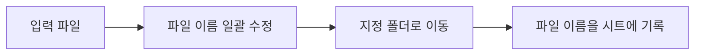
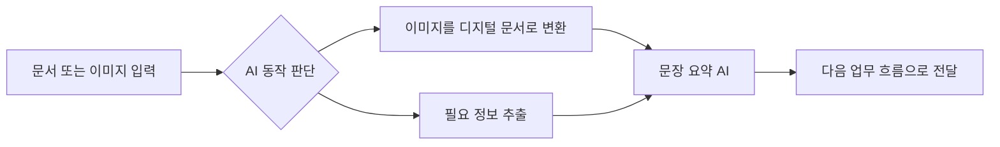

# n8n 소개

처음 환경을 준비하기 전에, 우리가 왜 n8n을 사용하는지부터 살펴보겠습니다.

## 업무 자동화와 n8n 소개

미래의 똑똑한 사무실은 어떤 모습일까요?

사람이 파일을 하나씩 열고, 내용을 확인하고, 정리하고, 답장을 쓰는 대신 컴퓨터가 먼저 자료를 읽고 상황을 판단합니다. 필요한 정보만 뽑아내고, 고객이나 동료에게 보낼 답변 초안을 만들고, 다음에 해야 할 일까지 이어서 처리합니다.

이 변화의 핵심은 **자동화가 단순 반복 작업을 넘어서 지능형 의사결정으로 확장되고 있다**는 점입니다.

## AI 시대 자동화의 패러다임 변화

| 구분 | 기존 자동화: 전통적 RPA | AI 기반 자동화: AI와 결합된 RPA |
| --- | --- | --- |
| 작업 방식 | 정해진 규칙에 따른 단순 반복 | 상황 판단과 지능형 의사결정 |
| 문서 처리 | 파일 이동, 이름 변경 중심 | 내용을 읽고 이해하여 분류 |
| 고객 응답 | 미리 작성된 템플릿 전송 | 맞춤형 답변을 실시간 생성 |
| 데이터 분석 | 단순 집계와 차트 생성 | 패턴 분석과 인사이트 도출 |

## 전통적 RPA 워크플로우

1. 입력 파일을 받습니다.
2. 파일 이름을 일괄 수정합니다.
3. 지정된 폴더로 이동합니다.
4. 파일 이름을 시트에 기록합니다.

## AI 기반 자동화 워크플로우

1. 입력 문서나 이미지를 받습니다.
2. AI가 어떤 처리가 필요한지 판단합니다.
3. 이미지를 디지털 문서로 변환합니다.
4. 긴 내용을 요약하거나 필요한 정보를 추출합니다.
5. 결과를 다음 업무 흐름으로 넘깁니다.

:::info RPA란?
RPA(Robotic Process Automation)는 "로봇 프로세스 자동화"라는 뜻입니다. 컴퓨터가 사람이 하던 반복 업무를 대신 수행하는 기술입니다.
:::

## 3가지 핵심 AI 자동화 기술

| 기술 | 무엇을 하나요? | 이번 실습에서의 예 |
| --- | --- | --- |
| Document AI | 이미지나 PDF 안의 글자를 읽고 구조화합니다. | 업로드한 노트 이미지에서 텍스트를 추출합니다. |
| LLM 챗봇 | 글을 이해하고 사람에게 필요한 답변을 만듭니다. | 노트 내용을 바탕으로 피드백과 OX 퀴즈를 생성합니다. |
| Agent AI | 상황을 보고 필요한 도구와 흐름을 선택합니다. | 입력 종류에 따라 OCR, 참고자료, 답변 생성 흐름을 연결합니다. |

## n8n의 특별함

n8n은 워크플로우 자동화 도구입니다. 어떤 일이 발생했을 때, 어떤 순서로 어떤 도구를 실행할지 시각적으로 연결할 수 있습니다.

| 세부 항목 | 전통적 자동화 도구(Zapier/Make) | n8n |
| --- | --- | --- |
| 비용 모델 | 사용량이 늘수록 비용이 커질 수 있습니다. | 오픈소스로 직접 실행할 수 있습니다. |
| 사용량 확장성 | 월 사용량 제한이나 추가 요금이 있을 수 있습니다. | 직접 실행하면 실습 범위 안에서 자유롭게 사용할 수 있습니다. |
| 데이터 소유권 | SaaS 업체 환경에 의존합니다. | 내 컴퓨터나 내가 관리하는 서버에서 실행할 수 있습니다. |
| 보안 통제 | 외부 서비스 정책에 의존합니다. | 데이터를 어디에서 처리할지 직접 통제할 수 있습니다. |
| AI 기능 | 기본 자동화 중심입니다. | AI Agent 워크플로우를 만들기 좋습니다. |

## 왜 지금 n8n을 배워야 할까요?

AI 도구를 잘 쓰는 것과 AI가 들어간 업무 흐름을 설계하는 것은 다릅니다. 앞으로는 **AI가 언제 어떤 도구를 사용해야 하는지 설계할 수 있는 사람**이 더 큰 생산성을 만들 수 있습니다.

## 점진적 개선으로 접근하기

처음부터 완벽한 자동화 시스템을 만들 필요는 없습니다. 실무 자동화는 보통 작게 시작해서 점점 고도화합니다.

:::tip 핵심 전략
처음에는 간단히 시작해서 작동만 확인해도 충분합니다. 그다음 차근차근 기능을 더하며 고도화된 자동화 시스템으로 발전시키면 됩니다.
:::
