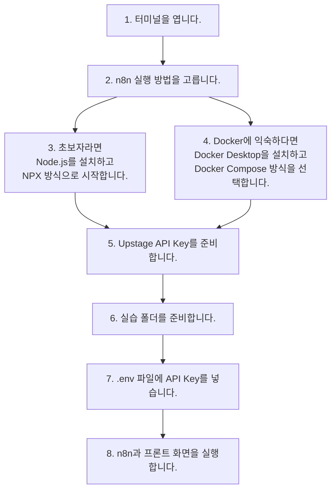

# 필요한 것 한눈에 보기

아무것도 설치되어 있지 않은 컴퓨터라고 가정하고 시작합니다.

## 필요한 도구

먼저 공통으로 필요한 도구입니다.

| 필요한 것 | 왜 필요한가요? |
| --- | --- |
| 웹 브라우저 | n8n과 실습 화면을 열기 위해 필요합니다. |
| 터미널 | 명령어를 실행하는 창입니다. |
| 텍스트 편집기 | `.env` 파일을 수정할 때 사용합니다. |
| Upstage API Key | OCR과 AI 답변 생성을 사용하기 위한 열쇠입니다. |
| 실습 폴더 | 프론트 화면과 n8n 워크플로우 파일이 들어 있습니다. |

그리고 n8n 실행 방법에 따라 아래 중 하나를 준비합니다.

| 실행 방법 | 추가로 필요한 것 | 이런 경우에 좋습니다 |
| --- | --- | --- |
| NPX로 직접 실행 | Node.js와 npm | 처음 n8n을 배우는 초보자에게 추천합니다. |
| Docker Compose로 실행 | Docker Desktop | Docker에 익숙하고 환경을 안정적으로 분리하고 싶을 때 추천합니다. |

이번 핸즈온에서는 **초보자에게 NPX 방식을 추천**합니다. Docker Desktop 설치와 컨테이너 개념이 익숙하다면 Docker Compose 방식으로도 같은 워크플로우 실습을 따라 할 수 있습니다.

## 실습 폴더 받기

실습 파일은 GitHub 저장소에서 받을 수 있습니다.

```text
https://github.com/snorose/2026-hackathon-hands-on-wiki
```

### Git으로 받기

Git을 사용할 수 있다면 아래 명령어로 실습 폴더를 받습니다.

```bash
cd "/Users/esc/Desktop/2026-hackathon"
git clone https://github.com/snorose/2026-hackathon-hands-on-wiki.git "Solar Teacher Low-Code"
```

이렇게 받으면 이후 문서의 경로와 같은 `Solar Teacher Low-Code` 폴더가 만들어집니다.

### ZIP 파일로 받기

GitHub 계정이 없거나 Git 사용이 익숙하지 않다면 ZIP 파일로 받을 수 있습니다.

1. 브라우저에서 `https://github.com/snorose/2026-hackathon-hands-on-wiki`에 접속합니다.
2. 초록색 `Code` 버튼을 누릅니다.
3. `Download ZIP`을 선택합니다.
4. 다운로드한 ZIP 파일의 압축을 풉니다.

직접 다운로드 링크는 아래와 같습니다.

```text
https://github.com/snorose/2026-hackathon-hands-on-wiki/archive/refs/heads/main.zip
```

압축을 풀면 폴더 이름이 `2026-hackathon-hands-on-wiki-main`처럼 보일 수 있습니다. 이후 문서의 명령어를 그대로 따라 하려면 이 폴더 이름을 `Solar Teacher Low-Code`로 바꿔 두면 편합니다.

## 전체 준비 순서



1. 터미널을 엽니다.
2. n8n 실행 방법을 고릅니다.
3. 초보자라면 Node.js를 설치하고 NPX 방식으로 시작합니다.
4. Docker에 익숙하다면 Docker Desktop을 설치하고 Docker Compose 방식을 선택합니다.
5. Upstage API Key를 준비합니다.
6. 실습 폴더를 준비합니다.
7. `.env` 파일에 API Key를 넣습니다.
8. n8n과 프론트 화면을 실행합니다.

다음 장에서는 n8n이 무엇이고 왜 사용하는지부터 살펴봅니다.
