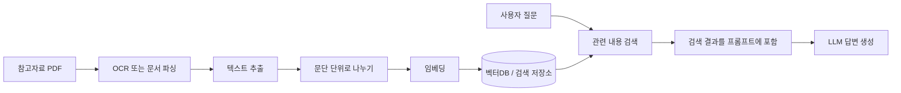

# PDF 일부를 참고자료로 바꾸기

이번 실습의 메인 흐름에서는 참고자료 PDF를 바로 업로드하지 않습니다.

대신 PDF 일부를 텍스트로 바꾼 뒤, 참고자료 칸에 붙여넣습니다.

## 왜 PDF를 바로 넣지 않나요?

비전공자 첫 실습에서 참고자료 PDF 업로드까지 넣으면 n8n 흐름이 복잡해집니다.

노트 PDF를 읽는 OCR 분기와 참고자료 PDF를 읽는 OCR 분기가 따로 필요해집니다.

그래서 메인 실습에서는 참고자료를 텍스트로 넣습니다.

## 이번 예시

이번 예시는 TOPCIT 시험 학습자료인 1장 “소프트웨어 개발” PDF를 기준으로 합니다.

- [TOPCIT 1장: 소프트웨어 개발 PDF 내려받기](/files/topcit-chapter-01-software-development.pdf)

실습에서는 이 PDF 전체를 바로 참고자료로 넣지 않고, `01_소프트웨어_개발.pdf`의 16-27페이지만 OCR로 텍스트화했습니다.

결과 파일은 실습 폴더의 `references/`에 둘 수 있습니다.

```text
2026-hackathon-hands-on/references/01_software_development_pages_16_27_ocr.txt
```

## 사용하는 방법

1. 텍스트 파일을 엽니다.
2. 필요한 부분만 복사합니다.
3. 프론트 화면의 참고자료 칸에 붙여넣습니다.
4. 노트를 입력하고 분석합니다.

## 그림은 어떻게 하나요?

이번 실습에서는 그림을 해석하지 않습니다. 글자만 참고자료로 사용합니다.

그림까지 이해하려면 이미지 설명 모델이나 문서 파싱 도구가 추가로 필요합니다.

## 실제 서비스로 확장한다면

실제 서비스에서는 참고자료 PDF를 매번 사람이 복사해 넣지 않고, 문서를 미리 처리해 검색 가능한 저장소에 넣습니다.



이번 실습에서는 이 과정을 단순화해, `references/`의 텍스트를 사람이 직접 참고자료 칸에 붙여넣습니다.
