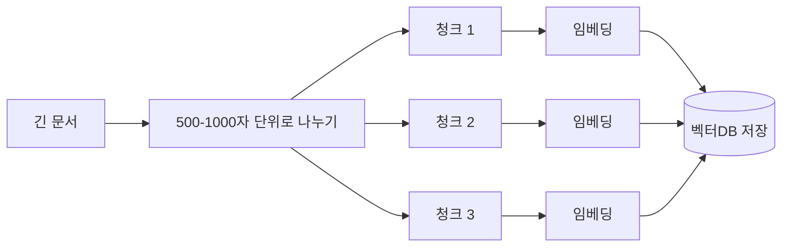
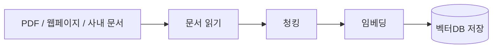
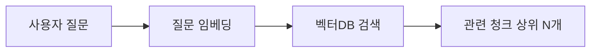

# 실제 RAG와 RAG-lite의 차이

이번 실습의 RAG-lite는 참고자료를 직접 붙여넣는 방식입니다.

실제 서비스에서는 보통 참고자료를 미리 저장해 두고, 질문과 관련 있는 부분만 찾아서 AI에게 전달합니다.

## 비교

| 구분 | RAG-lite | 실제 RAG |
| --- | --- | --- |
| 자료 입력 | 사람이 직접 붙여넣음 | 문서를 저장소에 넣음 |
| 검색 | 없음 | 질문과 관련된 부분을 검색 |
| 저장소 | 없음 | 벡터DB, 검색 DB 등 |
| 난이도 | 낮음 | 중간 이상 |
| 이번 실습 적합도 | 높음 | 선택 확장에 적합 |

## 벡터DB란?

벡터DB는 글의 의미를 숫자 형태로 저장해 두고, 질문과 의미가 가까운 문서를 찾는 저장소입니다.

이번 실습에서는 사용하지 않습니다. 핵심 개념을 먼저 이해하기 위해서입니다.

## 임베딩이란?

임베딩은 사람의 말을 컴퓨터가 비교할 수 있는 숫자 목록으로 바꾸는 과정입니다.

예를 들어 “강아지”와 “개”는 표현은 다르지만 의미가 가깝습니다. 임베딩 모델은 이런 의미적 가까움을 숫자 공간에서 가깝게 표현합니다.

```text
"강아지" -> [0.82, 0.12, -0.44, ...]
"개"     -> [0.80, 0.10, -0.40, ...]
"고양이" -> [0.30, 0.71, -0.20, ...]
```

실제 임베딩 벡터는 수백 개에서 수천 개 이상의 숫자로 이루어질 수 있습니다. 차원 수나 모델 이름은 서비스마다 다르며 계속 바뀔 수 있으므로, 처음에는 “문장의 의미를 숫자로 바꾼다”는 개념을 이해하는 것이 중요합니다.

대표적인 임베딩 제공 방식은 다음과 같습니다.

| 계열 | 특징 | 어울리는 상황 |
| --- | --- | --- |
| OpenAI 계열 | 범용 문서 처리에 널리 사용 | 영어와 일반 문서가 많은 경우 |
| Google 계열 | 멀티모달, 다국어 생태계와 함께 활용 | Google Cloud와 함께 쓰는 경우 |
| Upstage Solar 계열 | 한국어 문서와 Document AI 흐름에 연결하기 좋음 | 한국어 수업자료, 사내문서 중심 |
| 오픈소스 계열 | 직접 실행하거나 비용을 세밀하게 통제 가능 | 인프라를 직접 관리할 수 있는 경우 |

## 벡터DB의 역할

벡터DB는 임베딩으로 바뀐 문서 조각을 저장하고, 질문과 의미가 가까운 조각을 빠르게 찾습니다.

| 저장소 | 특징 | 어울리는 상황 |
| --- | --- | --- |
| Qdrant | 오픈소스로 직접 실행하기 좋음 | 학습용, 사내 PoC, 중소 규모 |
| Pinecone | 관리형 벡터DB 서비스 | 대규모 운영 서비스 |
| n8n 내장/간단 저장 방식 | 별도 설정이 적음 | 작은 테스트와 개념 학습 |

실제 운영에서는 의미 검색만 쓰지 않고 키워드 검색과 함께 쓰기도 합니다. 이것을 하이브리드 검색이라고 부릅니다.

| 검색 방식 | 장점 |
| --- | --- |
| 키워드 검색 | 정확히 같은 단어를 빠르게 찾음 |
| 의미 검색 | 표현이 달라도 뜻이 가까운 내용을 찾음 |
| 하이브리드 검색 | 정확성과 포괄성을 함께 노림 |

## 청킹이란?

긴 문서를 그대로 저장하면 질문과 관련 없는 내용까지 한꺼번에 들어갈 수 있습니다. 그래서 문서를 적당한 크기의 조각으로 나누는데, 이것을 청킹이라고 합니다.



청킹할 때는 문맥이 끊기지 않게 일부 내용을 겹쳐 넣기도 합니다. 이를 오버랩이라고 합니다.

| 설정 | 권장 방향 |
| --- | --- |
| 청크 크기 | 500-1000자 정도로 시작 |
| 오버랩 | 앞뒤 문맥이 끊기지 않게 일부 겹침 |
| 분할 기준 | 문장이나 문단 단위로 자연스럽게 |

## Pinecone을 쓰지 않는 이유

Pinecone은 벡터DB 서비스입니다.

실제 RAG를 만들 때 유용하지만, 첫 실습에서는 계정, 인덱스, 임베딩, 검색 흐름까지 설명해야 합니다.

그래서 이번에는 Pinecone 없이 RAG의 핵심 감각만 체험합니다.

## 실제 RAG 시스템의 3단계

실제 RAG 시스템은 크게 문서 저장, 검색, 답변 생성으로 나눌 수 있습니다.

### 1단계: 문서 처리와 저장

문서를 미리 읽고 검색 가능한 형태로 저장합니다.



n8n에서는 보통 아래처럼 구성할 수 있습니다.

```text
Manual Trigger
  -> 문서 읽기
  -> Code 노드로 청킹
  -> Embedding API 호출
  -> 벡터DB 저장
```

### 2단계: 검색

사용자 질문이 들어오면 질문도 임베딩으로 바꾸고, 벡터DB에서 의미가 가까운 문서 조각을 찾습니다.



### 3단계: 답변 생성

검색된 문서 조각을 프롬프트에 넣고 LLM에게 답변을 요청합니다.

```text
Chat Trigger
  -> 질문 임베딩
  -> 벡터DB 검색
  -> 관련 문서 조각 선별
  -> 프롬프트 구성
  -> LLM 답변 생성
```

이 구조가 완성되면 사용자는 “재택근무 신청 방법은?”처럼 질문하고, 시스템은 사내 문서에서 관련 내용을 찾아 근거 기반 답변을 만들 수 있습니다.

## 역사 선생님 AI로 생각해 보기

이번 Solar Teacher 실습과 연결해서 생각하면, 실제 RAG는 역사 선생님 AI에도 사용할 수 있습니다.

1. 역사 교과서 내용을 문단 단위로 나눕니다.
2. 각 문단을 임베딩해 벡터DB에 저장합니다.
3. 학생 질문을 임베딩합니다.
4. 관련 교과서 내용을 검색합니다.
5. 검색된 내용을 바탕으로 답변이나 퀴즈를 생성합니다.

예를 들어 학생이 “구석기 시대와 신석기 시대의 차이점은 무엇인가요?”라고 묻는다면, 시스템은 구석기와 신석기 관련 문단을 찾아 아래처럼 답할 수 있습니다.

```text
구석기 시대와 신석기 시대의 큰 차이는 도구 제작 방식과 생활 방식입니다.

- 구석기: 돌을 깨서 도구를 만들고, 사냥과 채집 중심으로 생활했습니다.
- 신석기: 돌을 갈아 더 정교한 도구를 만들고, 농경과 목축을 시작했습니다.

참고: 한국사 교과서 1단원
```

이렇게 RAG는 AI가 “아는 척”하게 만드는 기술이 아니라, 필요한 자료를 먼저 찾아 보고 그 자료를 기준으로 답하게 만드는 구조입니다.
