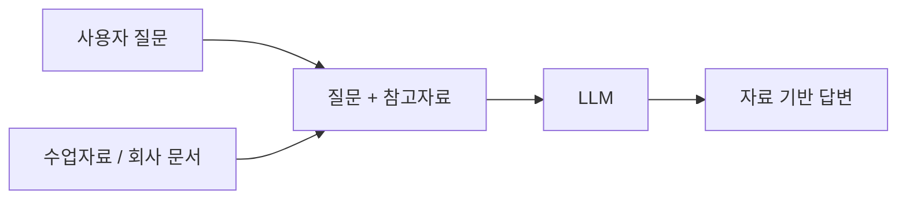
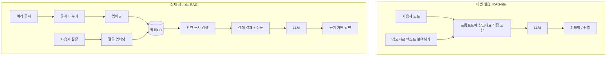

# RAG를 아주 쉽게 이해하기

RAG는 AI가 답하기 전에 참고자료를 함께 보게 하는 방법입니다.

조금 더 쉽게 말하면, **오픈북 시험을 보게 하는 것**과 비슷합니다.

## 참고자료가 없을 때

AI는 자신이 학습한 일반 지식에 기대어 답합니다.

이 방식도 유용하지만, 수업자료나 교재의 표현과 다를 수 있습니다.

예를 들어 “우리 회사 휴가 정책이 어떻게 되나요?”라고 물으면 일반 AI는 보통 세상에 널리 알려진 연차 제도나 일반적인 회사 규정을 바탕으로 답합니다. 하지만 실제로 필요한 답은 우리 회사의 사내 규정 문서 안에 있을 수 있습니다.

일반 LLM만 사용할 때 생기는 한계는 다음과 같습니다.

| 한계 | 설명 |
| --- | --- |
| 회사 고유 데이터 부족 | 내부 매뉴얼, 수업자료, 정책 문서를 모릅니다. |
| 최신 정보 부족 | 최근 바뀐 규정이나 자료가 반영되지 않을 수 있습니다. |
| 전문 맥락 부족 | 특정 수업, 조직, 업계의 표현을 놓칠 수 있습니다. |
| 할루시네이션 위험 | 모르는 내용을 그럴듯하게 지어낼 수 있습니다. |

## 참고자료가 있을 때

AI에게 “이 자료를 기준으로 판단해 줘”라고 말할 수 있습니다.

이번 실습에서는 참고자료 칸에 텍스트를 붙여넣고, n8n이 그 내용을 프롬프트의 `<정보>` 영역에 넣습니다.

이 방식은 AI의 답변 능력과 우리가 가진 자료를 결합합니다.

## 일반 검색과 RAG의 차이

일반 검색은 보통 같은 단어가 들어 있는 문서를 찾는 데 강합니다. 반면 RAG에서 자주 쓰는 의미 검색은 질문의 뜻과 가까운 문서를 찾는 데 초점을 둡니다.

| 구분 | 일반 키워드 검색 | 의미 기반 검색 |
| --- | --- | --- |
| 검색 방식 | 같은 단어가 있는지 확인 | 문장의 의미가 가까운지 확인 |
| 예시 검색어 | 고객 서비스 | 고객 지원, 사용자 도움, 구매자 상담도 함께 찾을 수 있음 |
| 장점 | 빠르고 직관적 | 표현이 달라도 관련 내용을 찾기 쉬움 |
| 한계 | 다른 표현을 놓칠 수 있음 | 임베딩과 저장소 구성이 필요함 |

RAG는 검색된 관련 자료를 LLM에게 함께 전달해 답변을 만들게 합니다. 그래서 “똑똑한 지식 관리사가 자료를 찾아 AI에게 건네주는 구조”라고 생각하면 쉽습니다.

## 왜 RAG-lite인가요?

실제 RAG는 보통 다음 과정을 포함합니다.

1. 여러 문서를 저장합니다.
2. 질문과 관련 있는 부분을 검색합니다.
3. 검색된 내용을 AI에게 전달합니다.
4. AI가 그 자료를 바탕으로 답합니다.

이번 실습은 이 중에서 “참고자료를 AI에게 전달한다”는 핵심만 다룹니다. 그래서 RAG-lite라고 부릅니다.

