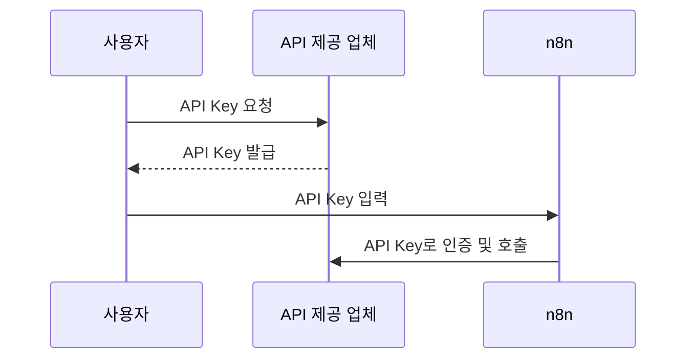
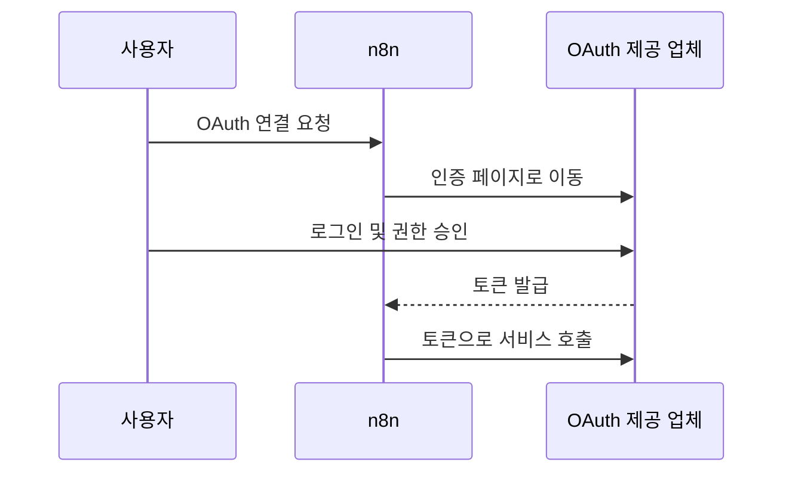
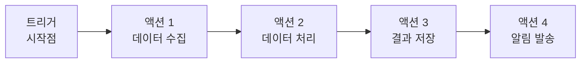
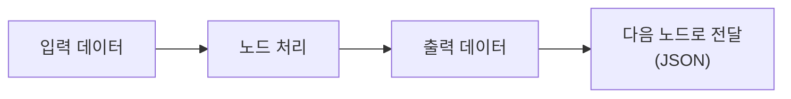
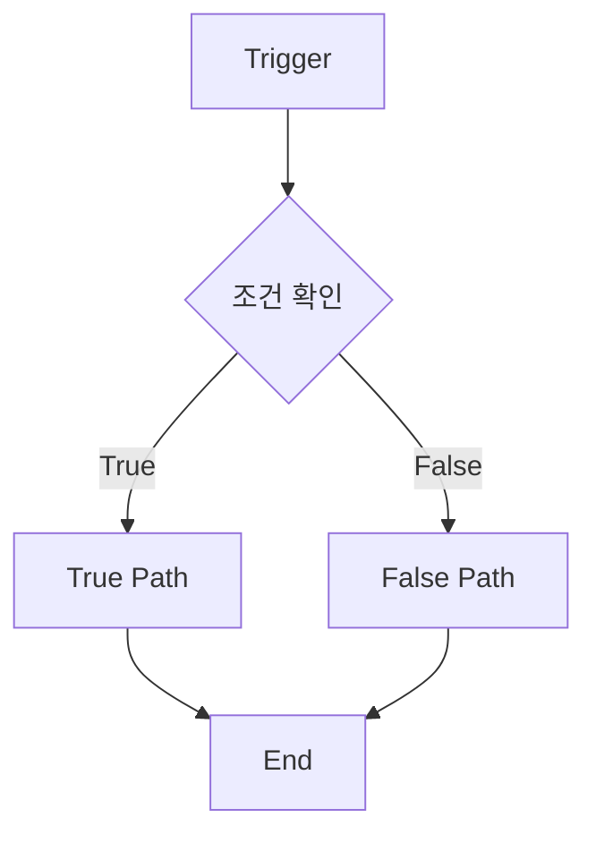
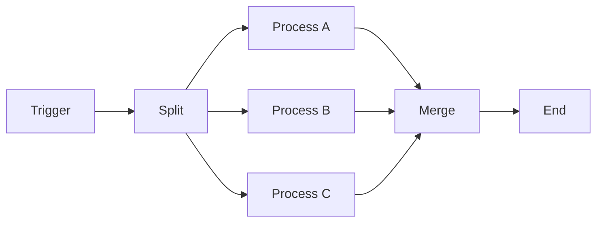

# n8n 에디터 UI 둘러보기

n8n 화면은 회사 사무실처럼 여러 공간으로 나뉘어 있습니다. 처음에는 복잡해 보일 수 있지만, 자주 쓰는 화면은 크게 5개입니다.

| 화면 | 쉬운 비유 | 하는 일 |
| --- | --- | --- |
| 메인 워크플로우 관리 화면 | 전체 프로젝트 관리실 | 워크플로우 생성, 검색, 복제, 공유, 보관 |
| Credentials 화면 | 열쇠 보관함 | 외부 서비스 API Key와 OAuth 연결 정보 관리 |
| Executions 화면 | 작업 모니터링실 | 실행 성공/실패 기록과 에러 확인 |
| Settings 화면 | 사무실 환경 설정 | 사용자, 라이선스, Community Node, 보안 설정 관리 |
| 워크플로우 제작 화면 | 실제 작업실 | 노드를 배치하고 연결해 자동화 흐름 제작 |

## 메인 워크플로우 관리 화면

n8n에 접속하면 워크플로우 목록을 볼 수 있습니다. 이 화면은 모든 자동화 프로젝트를 관리하는 중앙 통제실입니다.

[화면 추가 추천] n8n 메인 워크플로우 관리 화면

### Overview와 Personal

| 구분 | Overview | Personal |
| --- | --- | --- |
| 역할 | 전체 팀 프로젝트 관리 | 개인 작업 공간 |
| 비유 | 회사 전체 관리실 | 내 개인 책상 |
| 주요 기능 | 모든 워크플로우 조회 | 내 워크플로우 중심 관리 |

### 워크플로우 관리 기능

- `Create Workflow`: 새 워크플로우를 만듭니다.
- `Active` 토글: 자동화를 켜거나 끕니다.
- `Duplicate`: 기존 워크플로우를 복제합니다.
- `Share`: 동료에게 워크플로우를 공유합니다.
- `Archive`: 사용하지 않는 워크플로우를 보관합니다.
- 검색과 필터: 이름이나 상태로 빠르게 찾습니다.

워크플로우 이름은 나중에 찾기 쉽도록 의미 있게 정합니다.

```text
고객문의-자동응답-v1
노트분석-OCR-퀴즈생성
```

## Active 상태 이해하기

| 상태 | 의미 | 언제 사용하나요? |
| --- | --- | --- |
| Inactive | 비활성 상태입니다. 트리거가 자동 실행되지 않습니다. | 개발, 테스트, 수정 중 |
| Active | 활성 상태입니다. Webhook 같은 트리거가 실제로 동작합니다. | 실습 실행, 운영 배포 |

이번 실습에서 프론트 화면이 n8n Webhook을 호출하려면 가져온 워크플로우가 `Active` 상태여야 합니다.

:::warning
워크플로우를 수정한 뒤에는 반드시 저장하세요. 저장하지 않으면 브라우저를 새로고침하거나 다른 화면으로 이동할 때 변경 사항이 사라질 수 있습니다.
:::

## Credentials 화면

Credentials는 외부 서비스에 접속하기 위한 인증 정보입니다. 집 열쇠나 방문증처럼, n8n이 다른 서비스에 안전하게 접근할 수 있게 해 줍니다.

| 실생활 비유 | 크레덴셜 종류 | 용도 |
| --- | --- | --- |
| 집 열쇠 | API Key | 서비스에 직접 접근할 때 사용합니다. |
| 방문증 | OAuth 토큰 | 제한된 권한으로 안전하게 연결할 때 사용합니다. |

이번 Solar Teacher 실습에서는 Upstage API Key를 `.env`에 넣어 사용하므로 Credentials 화면에서 별도 등록을 많이 하지 않습니다. 하지만 Google Drive, Notion, Slack 같은 서비스를 연결할 때는 Credentials 화면을 자주 사용합니다.

### API Key 방식

API Key는 한 번 발급받은 문자열을 n8n에 입력하는 방식입니다. 설정은 간단하지만 노출되면 위험하므로 다른 사람에게 공유하면 안 됩니다.



### OAuth 방식

OAuth는 `Connect` 버튼을 누르고 로그인한 뒤 권한을 승인하는 방식입니다. Google, Microsoft, Dropbox 같은 서비스에서 자주 사용합니다.



## Executions 화면

Executions 화면은 공장의 생산 현황판처럼 워크플로우 실행 기록을 보여 줍니다.

[화면 추가 추천] n8n Executions 실행 목록 화면

확인할 수 있는 정보는 다음과 같습니다.

- 실행 성공/실패 상태
- 어떤 워크플로우에서 문제가 생겼는지
- 실행된 시간
- 각 노드의 입력과 출력 데이터
- 실패한 노드의 에러 메시지

실패한 실행은 빨간색으로 표시됩니다. 실패한 실행을 열고 빨간색 노드를 클릭하면 에러 원인을 더 자세히 볼 수 있습니다.

## 디버깅 기본 흐름

문제가 생기면 아래 순서로 확인합니다.

1. Executions 화면에서 실패한 실행을 엽니다.
2. 빨간색으로 표시된 노드를 찾습니다.
3. 실패 노드의 에러 메시지를 읽습니다.
4. 입력 데이터와 출력 데이터를 확인합니다.
5. 워크플로우를 수정하고 저장합니다.
6. 같은 입력으로 다시 실행해 확인합니다.

:::tip
Replay 기능을 사용하면 같은 입력 데이터로 반복 테스트할 수 있어 디버깅할 때 편합니다.
:::

## Settings 화면

Settings는 n8n의 환경을 관리하는 관리자 패널입니다.

[화면 추가 추천] n8n Settings 화면

자주 쓰는 설정은 다음과 같습니다.

- `User Settings`: 이름, 언어, 시간대 같은 개인 설정
- `Password Change`: 비밀번호 변경
- `API Keys`: n8n 자체 API를 호출할 때 쓰는 키 관리
- `Usage and plan`: 라이선스 키 입력과 플랜 확인
- `Community Nodes`: 커뮤니티가 만든 추가 노드 설치

Community Node는 스마트폰에 새 앱을 설치하듯이 n8n에 새로운 서비스 연동 노드를 추가하는 기능입니다.

:::warning
Community Node는 제3자가 개발한 패키지일 수 있습니다. 실습이나 운영 환경에 설치하기 전에 신뢰할 수 있는 노드인지 확인하세요.
:::

## 워크플로우 제작 화면

워크플로우 제작 화면은 실제 자동화를 만드는 핵심 작업 공간입니다.

[화면 추가 추천] n8n 워크플로우 제작 화면

### 캔버스 작업공간

- 점선 격자 배경 위에 노드를 배치합니다.
- 노드를 선으로 연결해 데이터 흐름을 만듭니다.
- 복잡한 워크플로우는 줌 인/아웃으로 전체를 확인합니다.
- 메모 노드를 추가해 설계 의도나 주의사항을 적을 수 있습니다.

### 노드 패널

오른쪽의 `+` 버튼 또는 `Tab` 키로 노드 패널을 열 수 있습니다.

주요 노드 카테고리는 다음과 같습니다.

| 카테고리 | 역할 |
| --- | --- |
| Triggers | 자동화 시작점입니다. |
| Actions | 실제 작업을 수행합니다. |
| Advanced AI | AI 기능을 활용합니다. |
| Data transformation | 데이터를 원하는 형태로 바꿉니다. |
| Flow control | 조건 분기와 반복 흐름을 만듭니다. |

## 노드와 연결 이해하기

n8n 워크플로우는 레고 블록처럼 작은 작업 단위를 조립해 하나의 자동화를 만드는 방식입니다.

| 구성 요소 | 쉬운 비유 | 역할 |
| --- | --- | --- |
| 트리거 노드 | 손님이 문을 두드리는 소리 | 워크플로우를 시작합니다. |
| 액션 노드 | 실제 일을 하는 직원 | 데이터를 처리하거나 외부 서비스를 호출합니다. |
| 연결선 | 정보가 흐르는 파이프라인 | 앞 노드의 결과를 다음 노드로 전달합니다. |

처음 연습할 때는 `Manual Trigger -> Set -> 결과 확인`처럼 아주 작은 흐름부터 만들어 보면 좋습니다.



### 단순 태스크와 워크플로우

단순 태스크는 하나의 작업을 처리하는 것이고, 워크플로우는 여러 작업을 이어 전체 업무 과정을 자동화하는 것입니다.

| 구분 | 단순 태스크 | 워크플로우 |
| --- | --- | --- |
| 범위 | 개별 작업 | 전체 프로세스 |
| 예시 | 번역, 요약, 생성 | 데이터 수집 -> 처리 -> 저장 -> 알림 |
| 특징 | 일회성 처리 | 연속적인 흐름 |
| 가치 | 한 작업의 효율 향상 | 전체 업무 자동화 |

핵심은 **트리거, 액션, 연결선**입니다. 시작 신호가 들어오면 여러 액션 노드가 연결선을 따라 차례로 실행되고, 각 노드는 JSON 형태의 데이터를 다음 노드로 넘깁니다.

## 노드 종류 이해하기

노드는 특정 작업을 수행하는 독립적인 블록입니다. 각 노드는 고유한 기능을 갖고, 설정값을 바꿔 다른 상황에 재사용할 수 있습니다.



### 트리거 노드

트리거 노드는 워크플로우를 시작하는 신호입니다.

| 종류 | 예시 | 언제 사용하나요? |
| --- | --- | --- |
| 이벤트 기반 | Webhook, Email Trigger, File Trigger | 외부에서 요청이나 변화가 들어올 때 |
| 시간 기반 | Schedule, Cron, Interval | 정해진 시간이나 주기마다 실행할 때 |
| 수동 실행 | Manual Trigger, Chat Trigger | 테스트하거나 직접 실행할 때 |

이번 실습에서 가장 중요한 트리거는 `Webhook`입니다. 프론트 화면에서 분석 요청을 보내면 n8n Webhook이 그 요청을 받아 워크플로우를 시작합니다.

### 액션 노드

액션 노드는 트리거 이후 실제 일을 처리합니다.

| 분류 | 대표 노드 | 역할 |
| --- | --- | --- |
| 데이터 처리 | Set, Code, Item Lists | 필드 추가, 수정, 삭제, 배열 처리 |
| 외부 서비스 연동 | HTTP Request, Email, Slack, Google Sheets | API 호출, 메시지 발송, 스프레드시트 조작 |
| 흐름 제어 | IF, Switch, Filter, Wait, Merge | 조건 분기, 대기, 병합, 반복 처리 |
| AI 관련 | Agent, LLM, Vector Store, Document Loader | AI 판단, 생성, 검색, 문서 처리 |

`Set` 노드는 데이터를 필요한 모양으로 정리할 때 자주 사용합니다. `HTTP Request` 노드는 외부 API를 호출할 때 사용합니다. 이번 실습에서는 Upstage API 호출 흐름을 이해하는 것이 중요합니다.

## 연결과 데이터 흐름

연결선은 노드 사이에서 데이터가 지나가는 길입니다. 보통은 성공한 결과가 다음 노드로 전달되는 `Main` 흐름을 사용하지만, 조건 분기나 에러 처리를 위해 다른 흐름을 만들 수도 있습니다.

| 연결 유형 | 의미 | 예시 |
| --- | --- | --- |
| Main Connection | 정상 처리 경로 | Webhook 요청을 Normalize Input으로 전달 |
| Error Connection | 오류 발생 시 처리 경로 | 실패 로그 저장, 관리자 알림 |
| 조건부 Connection | 조건에 따른 분기 | IF 노드의 True/False 경로 |



n8n에서 데이터는 크게 두 종류로 전달됩니다.

| 데이터 종류 | 의미 | 예시 |
| --- | --- | --- |
| JSON Data | 구조화된 텍스트 데이터 | 이름, 이메일, API 응답, 분석 결과 |
| Binary Data | 파일 데이터 | 이미지, PDF, 첨부파일 |

Expression 모드에서는 이전 노드의 데이터를 참조할 수 있습니다.

```text
{{ $json.name }}
{{ $json.email }}
{{ $('HTTP Request').item.json.response }}
```

직전 노드의 값은 `{{ $json.키 }}` 형태로, 특정 노드의 값은 `{{ $('노드명').item.json.키 }}` 형태로 참조합니다.

## 자주 쓰는 워크플로우 패턴

자동화는 요구사항에 따라 몇 가지 기본 패턴으로 설계할 수 있습니다.

| 패턴 | 구조 | 활용 사례 |
| --- | --- | --- |
| 순차 흐름 | Trigger -> Process A -> Process B -> End | 데이터 검증, 변환, 저장 |
| 병렬 흐름 | 하나의 입력을 여러 작업으로 나누고 합침 | 여러 API 동시 호출, 여러 채널 알림 |
| 조건부 흐름 | IF/Switch로 경로를 나눔 | 사용자 권한별 처리, 값에 따른 분기 |
| 반복 흐름 | 목록을 나누어 반복 처리 | 대량 데이터 처리, 페이지네이션, 재시도 |



처음에는 순차 흐름으로 단순하게 만들고, 필요할 때 조건부 흐름이나 병렬 흐름을 추가하는 편이 안전합니다.

## 워크플로우 설계 습관

좋은 워크플로우는 각 노드의 역할이 분명합니다.

- 한 노드가 너무 많은 일을 하지 않게 나눕니다.
- 노드 이름을 결과 중심으로 붙입니다.
- 각 연결선이 어떤 데이터를 넘기는지 확인합니다.
- 실패할 수 있는 API 호출에는 에러 처리 방식을 생각합니다.
- 먼저 `Manual Trigger`로 작게 테스트하고, 완성 후 `Webhook`이나 `Schedule`로 바꿉니다.

이번 Solar Teacher 실습도 같은 원리로 움직입니다. 프론트에서 요청이 들어오면 Webhook이 시작점이 되고, 입력 정리, OCR, 프롬프트 생성, AI 호출, 응답 정리 노드가 연결되어 하나의 업무 흐름을 만듭니다.

Webhook 설정, Manual/Schedule/Chat Trigger 예시, Set과 Code 노드 사용법은 다음 장에서 더 자세히 살펴봅니다.

## 저장과 실행 습관

n8n에서는 작업 중 저장 습관이 중요합니다.

- 노드를 추가하거나 수정한 뒤 `Ctrl + S` 또는 `Cmd + S`로 저장합니다.
- 전체 테스트는 `Execute Workflow`로 실행합니다.
- 특정 노드만 테스트해 중간 데이터를 확인할 수 있습니다.
- 문제가 있으면 Executions 화면에서 실패 기록을 확인합니다.
- 충분히 테스트한 뒤 `Active` 토글을 켭니다.

## 워크플로우 개발 프로세스

실제 자동화는 보통 아래 순서로 만듭니다.

1. 메인 화면에서 `Create Workflow`를 누릅니다.
2. 필요한 Credentials를 미리 준비합니다.
3. 워크플로우 제작 화면에서 트리거 노드부터 연결합니다.
4. 각 노드마다 입력과 출력을 확인합니다.
5. `Execute Workflow`로 전체 흐름을 테스트합니다.
6. 실패하면 Executions 화면에서 원인을 확인합니다.
7. 최종 저장 후 `Active` 토글을 켭니다.

이제 n8n 화면 구조를 봤으니, 다음 장에서는 트리거와 액션 노드를 조금 더 자세히 살펴보겠습니다.
