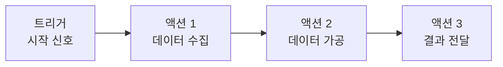
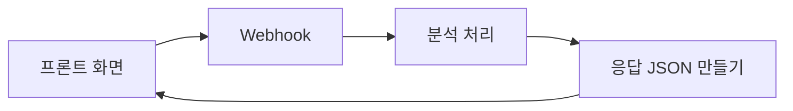
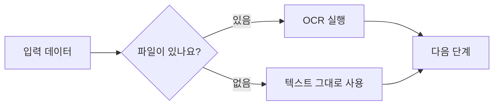

# 트리거와 액션 노드 이해하기

이 문서는 n8n에서 자주 만나는 트리거와 액션 노드를 조금 더 자세히 설명합니다.

앞의 `n8n 에디터 UI 둘러보기`가 화면 구조를 보는 장이라면, 이 문서는 실제로 노드를 고르고 설정할 때 필요한 감각을 익히는 장입니다.

:::info 이 문서와 워크플로우 뜯어보기의 차이
`n8n 워크플로우 뜯어보기` 섹션은 Solar Teacher 실습 워크플로우의 실제 노드를 설명합니다. 이 문서는 Webhook, Manual Trigger, Schedule Trigger, Chat Trigger, Set, Code 같은 일반 n8n 노드를 이해하기 위한 배경 설명입니다.
:::

## 트리거와 액션의 기본 구조

트리거는 “언제 시작할까?”를 정하고, 액션은 “무슨 일을 할까?”를 처리합니다.



| 구분 | 역할 | 예시 |
| --- | --- | --- |
| 트리거 노드 | 워크플로우를 시작합니다. | Manual Trigger, Schedule Trigger, Webhook, Chat Trigger |
| 액션 노드 | 데이터를 처리하거나 외부 서비스와 연결합니다. | Set, Code, HTTP Request, Email, Slack |
| 흐름 제어 노드 | 조건, 대기, 병합, 반복을 담당합니다. | IF, Switch, Filter, Wait, Merge |

처음에는 `Manual Trigger -> Set -> 결과 확인`처럼 작은 흐름으로 연습하는 것이 좋습니다.

## Webhook: 외부 요청을 받는 입구

Webhook은 외부 서비스나 프론트 화면이 n8n으로 신호를 보낼 수 있게 만든 전용 입구입니다.

이번 실습에서는 프론트 화면이 아래 주소로 분석 요청을 보냅니다.

```text
http://localhost:5678/webhook/solar-teacher/analyze
```

### Test URL과 Production URL

n8n Webhook에는 보통 테스트용 주소와 실제 사용 주소가 있습니다.

| 구분 | 용도 | 언제 사용하나요? |
| --- | --- | --- |
| Test URL | 워크플로우 제작 중 임시 테스트 | n8n 에디터에서 직접 실행하며 확인할 때 |
| Production URL | 활성화된 워크플로우 호출 | 프론트 화면이나 실제 서비스에서 호출할 때 |

실습에서 프론트 화면과 연결할 때는 워크플로우를 저장하고 `Active` 상태로 만든 뒤 Production URL을 사용하는 흐름을 기준으로 생각하면 됩니다.

### HTTP Method

Webhook은 요청 방식도 정합니다.

| 방식 | 의미 | 예시 |
| --- | --- | --- |
| GET | 데이터를 조회할 때 자주 사용 | 상태 확인, 간단한 테스트 |
| POST | 데이터를 보내 새 처리를 요청할 때 자주 사용 | 폼 제출, 파일 분석 요청 |
| PUT | 기존 데이터를 통째로 바꿀 때 사용 | 설정 전체 업데이트 |
| DELETE | 데이터를 삭제할 때 사용 | 항목 삭제 요청 |

이번 실습의 분석 요청처럼 노트 내용과 파일 정보를 함께 보내는 경우에는 보통 `POST`가 어울립니다.

### Path 설정

Path는 Webhook 주소의 마지막 이름입니다.

```text
/solar-teacher/analyze
/customer-inquiry
/order-update
```

Path는 나중에 봐도 목적을 알 수 있게 짓는 것이 좋습니다. `test1`, `abc`처럼 의미가 없는 이름은 여러 워크플로우가 생겼을 때 헷갈리기 쉽습니다.

### Authentication

Webhook URL을 아는 사람은 누구나 요청을 보낼 수 있습니다. 실제 서비스에서는 인증을 설정해 허가된 요청만 받는 것이 안전합니다.

| 인증 방식 | 설명 | 어울리는 상황 |
| --- | --- | --- |
| None | 인증 없이 호출 | 로컬 실습, 빠른 테스트 |
| Basic Auth | 아이디와 비밀번호 사용 | 간단한 내부 도구 |
| Header Auth / API Key | 요청 헤더에 키를 넣음 | 서버끼리 연결할 때 |
| OAuth | 권한 승인 흐름 사용 | Google, Microsoft 같은 서비스 연동 |

이번 핸즈온은 로컬 실습이므로 인증을 단순하게 다루지만, 공개 서비스에서는 Webhook URL을 그대로 노출하지 않도록 주의해야 합니다.

### Respond 설정

Webhook으로 요청을 보낸 쪽은 보통 “처리가 되었는지” 응답을 기다립니다.

n8n에서는 Webhook 노드가 바로 응답하게 하거나, `Respond to Webhook` 노드를 따로 두어 마지막 결과를 응답하게 만들 수 있습니다.

| 방식 | 설명 | 사용 예 |
| --- | --- | --- |
| 즉시 응답 | 요청을 받자마자 응답 | “접수 완료”만 바로 알려 줄 때 |
| 마지막 노드에서 응답 | 처리 결과를 만든 뒤 응답 | 분석 결과, 퀴즈, 피드백을 화면에 보여 줄 때 |
| Respond to Webhook 노드 사용 | 응답 내용을 별도 노드에서 명확히 구성 | 프론트가 JSON 결과를 기다릴 때 |

이번 실습처럼 프론트 화면에 피드백과 퀴즈를 보여 줘야 한다면, 워크플로우 끝에서 정리된 JSON을 응답하는 구조가 이해하기 쉽습니다.



## Manual Trigger: 지금 바로 눌러 보는 테스트 버튼

Manual Trigger는 워크플로우를 사람이 직접 실행할 때 쓰는 시작점입니다.

| 일상 비유 | n8n에서의 의미 |
| --- | --- |
| 새 전자제품 버튼 눌러보기 | 새 워크플로우가 동작하는지 확인 |
| 요리 중간에 맛보기 | 중간 데이터가 맞는지 확인 |
| 길을 미리 가 보기 | 실제 서비스 전에 흐름 점검 |

예를 들어 매일 오전 9시에 자동 실행될 Schedule 워크플로우도 처음부터 시간을 기다릴 필요는 없습니다. 개발 중에는 Manual Trigger로 지금 실행해 보고, 결과가 맞으면 Schedule Trigger로 바꾸면 됩니다.

Manual Trigger는 아래 상황에 특히 좋습니다.

- 새 노드를 추가한 뒤 입력과 출력 확인
- API 연결 상태 점검
- 데이터 변환 결과 확인
- 오류가 생기는 지점 찾기

## Schedule Trigger: 정해진 시간에 자동 실행

Schedule Trigger는 알람시계처럼 정해진 시간이나 간격에 워크플로우를 실행합니다.

| 일상 예시 | 업무 자동화 예시 |
| --- | --- |
| 매일 오전 7시 알람 | 매일 오전 9시 매출 리포트 생성 |
| 매주 일요일 할 일 알림 | 매주 월요일 고객 만족도 조사 발송 |
| 매달 1일 월세 납부 | 매월 1일 정산 보고서 생성 |

Schedule Trigger를 쓸 때는 실행 주기와 시간대를 함께 확인해야 합니다.

| 설정 | 확인할 것 |
| --- | --- |
| 실행 주기 | 매분, 매시간, 매일, 매주, 매월 중 무엇인지 |
| 실행 시간 | 몇 시에 실행할지 |
| 시간대 | 내 컴퓨터 또는 서버의 시간대가 맞는지 |
| 테스트 방법 | 실제 시간을 기다리지 않고 Manual Trigger로 먼저 검증했는지 |

처음에는 “매일 9시”처럼 단순한 주기로 시작하고, 필요할 때 더 정교한 스케줄로 확장하는 편이 안전합니다.

## Chat Trigger: Webhook 없이 대화로 테스트하기

Chat Trigger는 채팅창을 통해 AI 흐름을 바로 테스트할 수 있는 시작점입니다.

Webhook은 외부 프론트나 다른 서비스가 요청을 보내야 하지만, Chat Trigger는 n8n 안에서 직접 문장을 입력해 볼 수 있습니다.

| 장점 | 설명 |
| --- | --- |
| 빠른 테스트 | 별도 프론트 화면 없이 바로 질문을 입력할 수 있습니다. |
| 반복 실험 | 다양한 문장으로 여러 번 테스트하기 좋습니다. |
| AI 응답 확인 | LLM 응답 품질을 빠르게 비교할 수 있습니다. |
| 오류 위치 파악 | 어떤 단계에서 실패하는지 실행 흐름을 볼 수 있습니다. |

Chat Trigger는 고객 문의 시나리오, AI 상담 응답, 문서 질의응답 같은 흐름을 만들 때 유용합니다. 다만 이번 Solar Teacher 실습은 프론트 화면과 n8n Webhook을 연결하는 구조이므로, Chat Trigger는 확장 학습용으로 이해하면 됩니다.

## Set 노드: 데이터 필드 정리하기

Set 노드는 들어온 데이터에 필드를 추가하거나, 기존 값을 고치거나, 필요 없는 값을 정리할 때 사용합니다.

| 기능 | 설명 | 예시 |
| --- | --- | --- |
| 필드 추가 | 새 데이터 항목을 만듭니다. | `status`, `created_date` 추가 |
| 필드 수정 | 기존 값을 원하는 형태로 바꿉니다. | 이메일을 소문자로 변환 |
| 필드 삭제 | 다음 단계에 필요 없는 값을 제거합니다. | 임시 데이터 제거 |
| 필드 이름 변경 | 키 이름을 더 알기 쉽게 바꿉니다. | `raw_email`을 `email`로 변경 |

입력 데이터가 아래와 같다고 해 보겠습니다.

```json
{
  "name": "김철수",
  "age": 30,
  "raw_email": "KIM.CHEOLSU@COMPANY.COM"
}
```

Set 노드를 거친 뒤에는 다음처럼 정리할 수 있습니다.

```json
{
  "name": "김철수",
  "age": 30,
  "email": "kim.cheolsu@company.com",
  "created_date": "2024-01-15",
  "status": "active",
  "age_group": "30대"
}
```

Set 노드는 “있는 데이터를 그대로 넘기지 않고, 다음 노드가 쓰기 좋은 모양으로 정리하는 단계”라고 보면 됩니다.

## Code 노드: 복잡한 로직 처리하기

n8n의 Code 노드는 JavaScript 또는 Python 코드로 더 복잡한 처리를 할 때 사용합니다. 예전 자료에서는 비슷한 역할의 노드를 Function 노드라고 부르기도 합니다.

| 작업 | Set 노드 | Code 노드 |
| --- | --- | --- |
| 단순 필드 추가 | 적합 | 가능 |
| 간단한 값 변환 | 적합 | 가능 |
| 조건문 처리 | 제한적 | 적합 |
| 반복문 처리 | 어려움 | 적합 |
| 복잡한 계산 | 어려움 | 적합 |

예를 들어 구매 이력 합계에 따라 고객 등급을 정해야 한다면 Code 노드가 더 알맞습니다.

```js
const customer = $input.first().json;
const purchases = customer.purchases || [];

let totalAmount = 0;

for (const purchase of purchases) {
  totalAmount += purchase.amount;
}

let grade = 'Bronze';

if (totalAmount >= 1000000) {
  grade = 'Diamond';
} else if (totalAmount >= 500000) {
  grade = 'Gold';
} else if (totalAmount >= 100000) {
  grade = 'Silver';
}

return [
  {
    json: {
      ...customer,
      grade,
      totalPurchase: totalAmount,
    },
  },
];
```

Code 노드는 강력하지만 처음부터 많이 쓰면 워크플로우가 어려워질 수 있습니다. 단순한 값 정리는 Set 노드로 처리하고, 조건문이나 반복문이 필요한 부분만 Code 노드로 옮기는 방식이 좋습니다.

## 흐름 제어 노드: 조건, 대기, 병합

워크플로우가 길어지면 모든 데이터가 같은 길로만 흐르지 않습니다. 상황에 따라 다른 길로 보내거나, 잠시 기다리거나, 여러 결과를 합쳐야 합니다.

| 노드 | 역할 | 예시 |
| --- | --- | --- |
| IF | 참/거짓 조건 분기 | 파일이 있으면 OCR, 없으면 텍스트 그대로 사용 |
| Switch | 여러 조건 중 하나 선택 | 지역별 담당자 배정 |
| Filter | 조건에 맞는 데이터만 통과 | 미납 고객만 남기기 |
| Wait | 일정 시간 또는 조건까지 대기 | 이메일 발송 후 5분 뒤 후속 메시지 |
| Stop and Error | 워크플로우 중단 | 필수 데이터가 없을 때 명확히 실패 처리 |
| Merge | 여러 흐름을 하나로 합침 | 여러 API 응답을 모아 최종 보고서 생성 |

조건부 흐름은 사람의 “만약 이렇다면, 저렇게 하자”라는 판단을 자동화로 옮기는 방식입니다.



## 실습에서 기억할 기준

처음부터 모든 노드를 외울 필요는 없습니다. 아래 기준만 기억해도 워크플로우를 읽는 데 도움이 됩니다.

| 하고 싶은 일 | 먼저 떠올릴 노드 |
| --- | --- |
| 지금 바로 테스트 | Manual Trigger |
| 정해진 시간에 실행 | Schedule Trigger |
| 외부 화면이나 서비스에서 요청 받기 | Webhook |
| AI 대화 흐름 테스트 | Chat Trigger |
| 데이터 모양 정리 | Set |
| 복잡한 조건과 반복 처리 | Code |
| 외부 API 호출 | HTTP Request |
| 조건에 따라 갈림길 만들기 | IF 또는 Switch |
| 여러 결과 합치기 | Merge |

이번 Solar Teacher 워크플로우에서는 Webhook으로 시작해 입력을 정리하고, 조건에 따라 OCR을 거친 뒤, AI 호출 결과를 프론트 화면에 돌려주는 흐름을 사용합니다.
