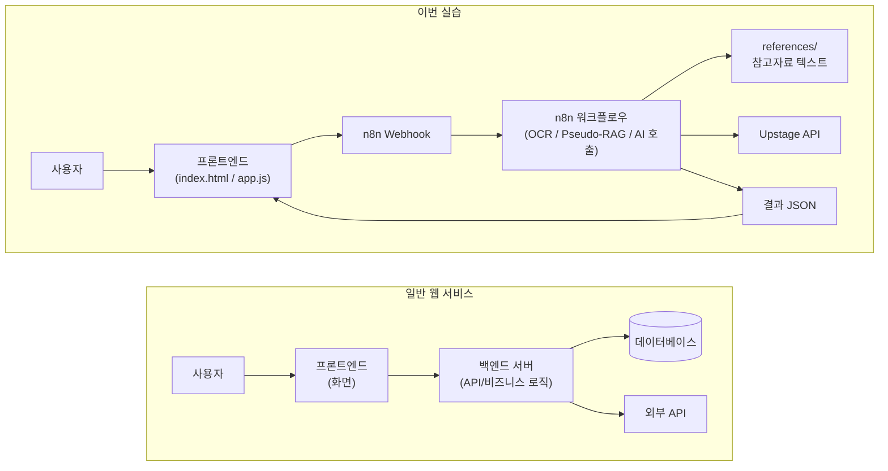

# 폴더 구조 이해하기

실습 폴더는 작은 AI 서비스 하나를 실행하기 위한 파일들로 구성되어 있습니다.

```text
2026-hackathon-hands-on/
  docker-compose.yml
  .env.example
  frontend/
  workflows/
  references/
  n8n_data/
```

## 중요한 폴더와 파일

| 이름 | 역할 |
| --- | --- |
| `docker-compose.yml` | n8n을 Docker로 실행하는 설정 파일입니다. |
| `.env.example` | 환경변수 예시 파일입니다. |
| `.env` | 실제 API Key를 넣는 파일입니다. 직접 만들어야 합니다. |
| `frontend/` | 사용자가 보는 웹 화면입니다. |
| `workflows/` | n8n에 가져올 워크플로우 JSON 파일이 들어 있습니다. |
| `references/` | Pseudo-RAG에 넣어 볼 참고자료 텍스트가 들어갑니다. |
| `n8n_data/` | n8n이 내부적으로 쓰는 데이터 폴더입니다. |

## 별도 백엔드는 없습니다

일반적인 웹 서비스는 프론트엔드와 백엔드가 따로 있을 수 있습니다.

이번 실습에서는 백엔드를 따로 실행하지 않습니다. n8n이 백엔드처럼 요청을 받고, OCR과 AI 호출을 처리합니다.


